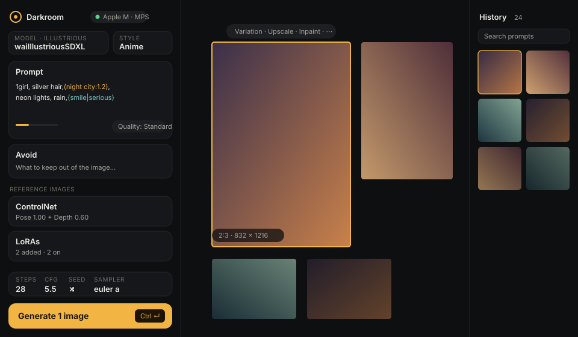
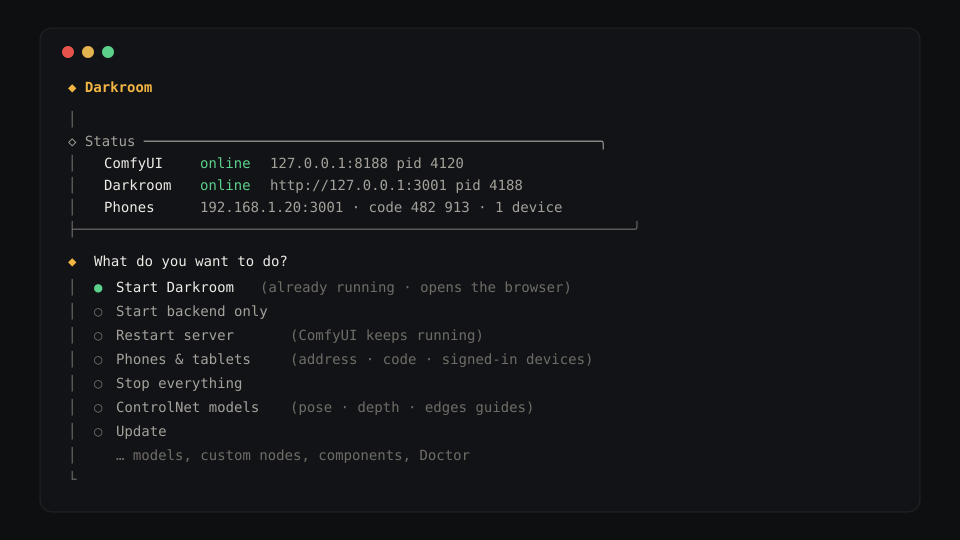

# Darkroom

A local image-generation studio inspired by NovelAI / SeaArt, running on a headless [ComfyUI](https://github.com/comfyanonymous/ComfyUI). Darkroom installs and manages ComfyUI for you, so you never touch a node graph — and you can use it from your phone on the same Wi-Fi.

Works on **Windows**, **macOS** (Apple Silicon recommended), and **Linux**.

<p align="center">
  
</p>
<p align="center">
  
</p>

## Install

You don't need Node or Python beforehand — the launcher downloads what it needs into the `dependencies/` folder inside Darkroom. On macOS, **Install everything** may ask to install Apple's Command Line Tools (for git); on Linux, install `git` from your package manager first.

1. **Download** the ZIP: **Code → Download ZIP** on GitHub, then unzip it anywhere (e.g. your Documents folder).
2. **Open the launcher** for your system:
   - **Windows:** double-click **`Start Darkroom (Windows).bat`**.
   - **macOS:** double-click **`Start Darkroom (Mac).command`**. If macOS blocks it, open **System Settings → Privacy & Security**, scroll to the message about Darkroom, and click **Open Anyway**. (Or run `xattr -dr com.apple.quarantine` on the folder in Terminal.)
   - **Linux:** run `./launcher/start-linux.sh` from a terminal (`chmod +x launcher/start-linux.sh` first if needed).
3. **First run** opens the setup menu. Pick one:
   - **Install everything** — downloads ComfyUI and PyTorch for your hardware (NVIDIA CUDA, Apple Silicon MPS, or CPU) into `dependencies/`.
   - **Use existing ComfyUI** — point at a ComfyUI you already have (source, Windows portable, or the Desktop app).
   - **Remote ComfyUI** — use ComfyUI running on another machine (it must be started with `--listen`).
4. Choose **Start Darkroom**. ComfyUI and the Darkroom server start and your browser opens.

Next time, just open the launcher again and choose **Start Darkroom**.

**What's in the folder:** `Start Darkroom (Mac).command` / `Start Darkroom (Windows).bat` start it; `launcher/` is the terminal menu; `client/` and `server/` are the app; `dependencies/` holds ComfyUI, its models and the portable tools; `logs/` has the logs. Installs from before this layout keep ComfyUI and `runtime/` straight in the Darkroom folder — the launcher offers **Tidy up folders** to move them into `dependencies/` (a rename on the same disk; nothing is copied).

<details>
<summary>Prefer git? (macOS / Linux one-liner)</summary>

```bash
curl -fsSL https://raw.githubusercontent.com/etavak/Darkroom/main/install.sh | bash
```

Clones (or updates) `~/Darkroom` and launches it. If git is missing on macOS, it offers the Xcode Command Line Tools and waits for them.
</details>

## Adding models

From the launcher menu: **Install model from file** (drag a file into the terminal), **Download model from URL** (Civitai, Hugging Face, or a direct link), **Manage models**, or **ControlNet models**. In the web UI, use **Add model…** in any model picker (or **Add file** in the LoRA picker).

- The model type is detected from the file. Checkpoints and diffusion models ask for their **family** (SDXL, Pony, Illustrious, NoobAI, Anima, Flux, SD3, …) so the right defaults and tags apply.
- Families that need extra files (text encoders, VAE) offer to download them, sized to your VRAM and checksum-verified.
- Files outside ComfyUI can be **linked** instead of copied.
- `.gguf` quantized models are supported via the optional ComfyUI-GGUF node (offered automatically).
- **ControlNet models** — one *SDXL Union* file covers every guide type for SDXL, Illustrious, NoobAI and Pony; SD 1.5 and Flux have their own. The launcher pre-selects the right one for the models you have, and the ControlNet card offers it when you add a guide. ControlNet Aux (pose / depth / edge maps from photos) is offered too.
- **Face detailer** — needs Impact Pack, Impact Subpack and a face model; launcher → **Face detailer** installs all three (restart ComfyUI afterwards). The Face detailer card says what's missing.
- **Civitai and Hugging Face keys** — some Civitai files require you to be signed in, and some Hugging Face files are gated. Add your key in **Preferences → Models & folders**, or right in the Add model dialog when a download asks for it (Civitai: *Account settings → API keys*; a read-only key is enough). Keys are stored on the computer running Darkroom and never shown again.

## Features

- **Studio** — controls on the left, every image on a pan-and-zoom canvas (variations, upscales and edits sit next to their original), History on the right with search, model filter, pins and multi-select download / delete. Right-click any image for Reuse, Copy prompt, Details and more; press **?** for keyboard shortcuts.
- **Model-aware presets** — tags, sampler, CFG and resolution follow the model family and style; **Quality** and **Avoid** levels add the family's recommended tags.
- **Prompting** — Danbooru / e621 tag autocomplete that matches word starts and typos, highlighted `(tag:1.2)` weights, `{a|b}` choices and `__wildcards__`, a dice for a random prompt in your model's style, and optional AI **Enhance** (any OpenAI-compatible API) with compare and undo.
- **Image to image** — restyle or edit a base image, and **Inpaint & extend** in a full-screen mask editor (brush, eraser, fill, drag the edges out; zoom and pan). A before/after slider compares any upscale, inpaint or enhance with its original.
- **ControlNet** — up to three guides (Pose, Depth, Edges, Line art, Tile, or a ready-made map), each with strength and step range, and **Show map** to see what the model will follow.
- **LoRAs** — preview, the base model each was made for, a warning when it doesn't suit the current model, trigger-word chips that add themselves to the prompt, drag to reorder.
- **More** — hires fix, face detailer, upscaling, Variation, a queue with Stop, drag-and-drop or paste an image (use it as the base, as a guide, or load the settings saved in a Darkroom PNG).
- **On your phone** — a phone layout with the image, a thumbnail strip and the prompt; tap for full screen, press and hold for actions. Other devices sign in with a 6-digit code that changes every 30 seconds (launcher → **Phones & tablets**, or **Preferences → Network** on the computer).

## Updating

Choose **Update** in the launcher menu. Darkroom downloads the latest version from GitHub and applies it in place, keeping your settings, history, models, and ComfyUI. Anything replaced is backed up and restored automatically if the update fails. ComfyUI, PyTorch, and the other components can be updated from the same menu. **Preferences → Updates & backups** shows your version and checks for a new one.

After an update (or when the status box says *Update ready*), choose **Restart server** — ComfyUI keeps running. If the launcher itself was updated while it was open, it tells you to quit and open it again.

## Troubleshooting

- **Doctor** (launcher menu) checks every component and offers repairs.
- **Diagnostics** shows your system, GPU, and paths; **Preferences → Advanced → Diagnostics** in the web UI copies a report with recent logs.
- Logs live in `logs/` (`comfyui.log`, `server.log`, and per-operation logs in `logs/ops/`).
- The launcher's code is in `launcher/` (`launcher/index.js` is the menu; `launcher/actions/` holds each menu item).
- **A custom node isn't showing up** (e.g. the ControlNet card says ControlNet Aux needs a restart) — ComfyUI only loads custom nodes when it starts. Choose **Stop everything**, then **Start Darkroom**. Stop everything also finds a ComfyUI from this folder that the launcher has no record of (for example after you re-unzipped Darkroom) and offers to stop it.
- **Upscale fails on a Mac with "view size is not compatible…"** — a ComfyUI bug on Apple Silicon that Darkroom works around with a small add-on it copies into ComfyUI on every start. Restart ComfyUI from the launcher (Stop everything → Start Darkroom) to load it.
- **A Civitai download fails with "needs you to be signed in"** — add your Civitai API key (see *Adding models*).

## Configuration

The setup wizard writes `.env` (see [`.env.example`](.env.example)); you rarely need to edit it.

| Variable | Meaning |
|----------|---------|
| `PORT` | Darkroom server port (default `3001`) |
| `COMFY_URL` | ComfyUI base URL |
| `COMFY_MODE` | `local` (Darkroom starts ComfyUI) or `remote` |
| `COMFY_DIR` | Local ComfyUI / Windows portable root |
| `COMFY_PYTHON` | Optional Python override |
| `CIVITAI_TOKEN` / `HF_TOKEN` | Download keys for sign-in-only Civitai files and gated Hugging Face files (easier to set in **Preferences → Models & folders**) |

Most other options live in the web UI under **Preferences**.

## Development

Requires Node.js 22.

```bash
npm install
npm run dev        # UI on http://localhost:5173, API on http://localhost:3001
npm run typecheck
npm run lint
npm test           # server, launcher and client tests (Node 22)
```

`npm run cli` opens the launcher menu. Tests run against a recorded ComfyUI node list (`server/test/fixtures/object_info.json`; refresh it from a running ComfyUI with `node server/test/tools/capture-object-info.mjs`), a fake ComfyUI and throwaway folders — never your data. `npm run build && npm start` serves the production build. A minimal fake ComfyUI for API smoke tests: `MOCK=true npm run mock:comfy`. To run a second dev UI against another server, start the server with `PORT=3002` and the client with `DARKROOM_API_PORT=3002`.

## License

MIT — see [LICENSE](LICENSE).
